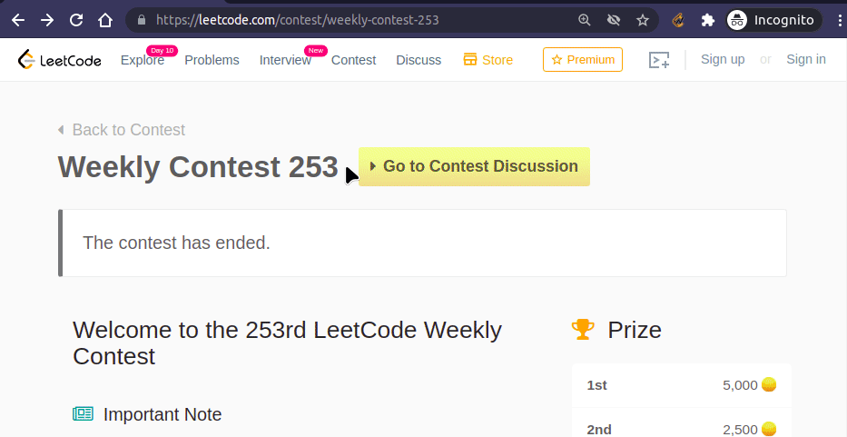
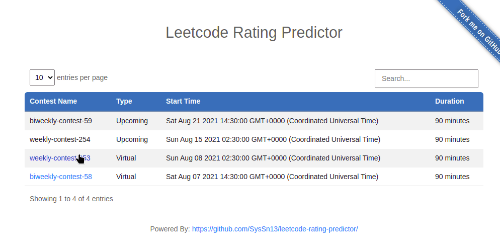
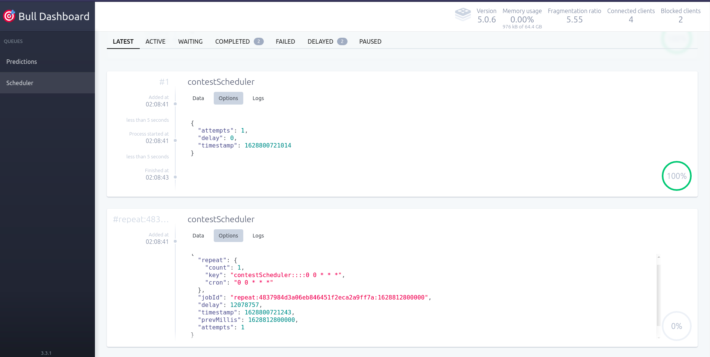
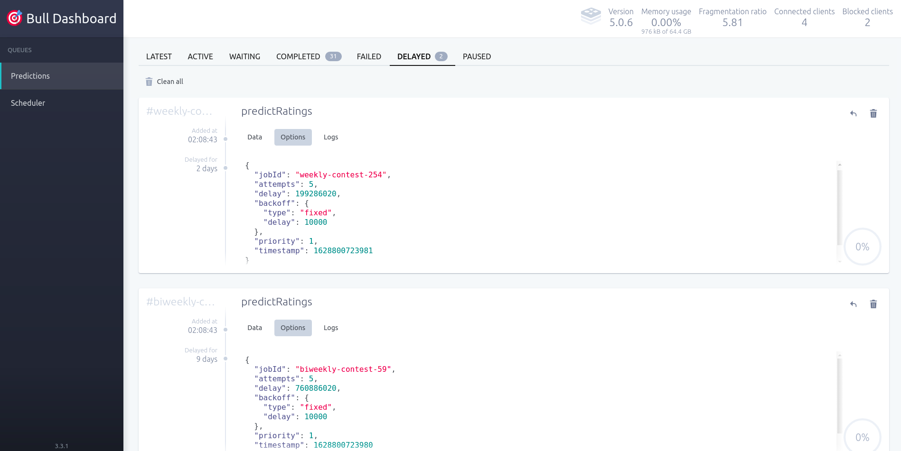

<!-- markdownlint-disable MD033 -->

<h1 align="center">
  <a href="https://github.com/SysSn13/leetcode-rating-predictor">
    
  </a>
</h1>

<div align="center">
  <h3>LC Predictor</h3>
  Want to see your leetcode rating change right after the contest? Well, you are in the right place!
  <br />
  <br />
</div>

<br />
<div align="center">
  <a href="https://chrome.google.com/webstore/detail/lc-predictor/jfhgaegpgiepniiebglgjhhfnjcibphh" target="_blank">
    </img>
  </a>
</div>

<div align="center">
  <a href="https://github.com/SysSn13/leetcode-rating-predictor/blob/main/LICENSE"></a>
  <a href="https://github.com/SysSn13/leetcode-rating-predictor/graphs/contributors" alt="Contributors">
    
  </a>
  <a href="https://chrome.google.com/webstore/detail/lc-predictor/jfhgaegpgiepniiebglgjhhfnjcibphh">
    
  </a>
  <a href="https://chrome.google.com/webstore/detail/lc-predictor/jfhgaegpgiepniiebglgjhhfnjcibphh">
    
  </a>

</div>
<br />

# About

It takes about 4-5 days for leetcode to update the contest ratings of participants. So you have to wait for a long time to know your rating changes. This application predicts accurate leetcode rating changes for all the contestants within a few minutes of completion of the contest.

# Getting started

This project consists of two types of user interfaces. You can either use browser extension or the website to get your rating changes.

## Chrome extension

You can install the extension from [Chrome Web Store](https://chrome.google.com/webstore/detail/lc-predictor/jfhgaegpgiepniiebglgjhhfnjcibphh). It adds the rating changes on leetcode ranking pages itself.

<div align="center">
  
</div>

## Website

You can also visit [lcpredictor.onrender.com](https://lcpredictor.onrender.com/) to get your rating changes.

<div align="center">
  
</div>

# How It Works

This project is written in Node + MongoDB + Redis tech stack. We can divide it into three microservices.

|  #  |    Name    | Languages |
| :-: | :--------: | :-------: |
| 1.  | Background |  Js, Cpp  |
| 2.  |  Website   |  Js, Ejs  |
| 3.  |    API     |    Js     |

## Backgound

It is the most important part of the project. It's job is to fetch the data from leetcode and predict the contest ratings periodically.

### Rating prediction

Rating prediction is a cpu intensive task. Therefore a [**nodejs C++ addon**](https://nodejs.org/api/addons.html) is implemented for this task so that we can utilize threading with better performance using **C++**. For performance measurement we got these results :

|           | No. of Threads |      Contest       | Time taken to make predictions(s) |
| :-------: | :------------: | :----------------: | :-------------------------------: |
|    Js     |       1        | Weekly contest 242 |              186.589              |
| C++ addon |       1        | Weekly contest 242 |              39.607               |
| C++ addon |       2        | Weekly contest 242 |              19.963               |
| C++ addon |       4        | Weekly contest 242 |              11.401               |
| C++ addon |       8        | Weekly contest 242 |              20.304               |

#### Machine configuration :

| Property  | Value                                   |
| :-------- | :-------------------------------------- |
| Processor | Intel® Core™ i5-8250U CPU @ 1.60GHz × 8 |
| Memory    | 7.7 GB                                  |
| OS        | Ubuntu 21.04                            |

It implements leetcode's latest rating prediction algorithm. Rating predictions are very close to the original rating but the accuracy may not be 100% due to changes in contest rankings after the completion of contest (leetcode rejudges some submissons).

These are the results for the predictions of weekly-contest-242:

|  Measure  |       Value        |
| :-------: | :----------------: |
|    MSE    | 167.7947072739485  |
| R-squared | 0.9988091420057561 |

### Job scheduling

Job scheduling is required for processing jobs on desired time. Leetcode contests are weekly and biweekly. We can schedule them by scheduling a repeated job. But for making it more generic, job schedulers are implemented who schedules prediction and data update jobs. These job schedulers are scheduled as a repeated job. It is accomplished by using [bull](https://github.com/OptimalBits/bull), a redis based queue for Node. A bull dashboard is also integrated using [bull-board](https://github.com/felixmosh/bull-board).

<div align="center">
  
  
</div>

## Website

It is built using [express](https://expressjs.com/) framework. Ejs is used for writing templates. It contains a table for contests and ranking pages with predicted rating changes for all the contests. Pagination is added to ranking pages for better user experience and performace.

## API

It is also implemented using [express](https://expressjs.com/) framework. It contains an endpoint for fetching users'
predicted rating changes which is used in the browser extension.

IP based rate limit is enforced for both the API and the website using [express-rate-limit](https://github.com/nfriedly/express-rate-limit).

# Development

## Setup

-   Clone the repository
    ```bash
    git clone https://github.com/SysSn13/leetcode-rating-predictor
    ```
-   Install the dependencies
    ```bash
    npm install
    ```
-   Setup environment variables

    ```bash
    cp .env.example .env
    ```

    Fill in the required values in the `.env` file.

-   Build the predict-addon (if you are using different node version)
    ```bash
    npm run buildAddon
    ```
-   Start the project
    ```bash
    npm start
    ```
-   Or start the development server by:
    ```bash
    npm run dev
    ```

## Environment variables

```
DATABASE_URL: Connection string for mongodb.

# for web
WEB: Whether to run the website or not. (0 or 1)

RATE_LIMIT_WINDOW: Window size for rate limit in milliseconds (default: 10000).

RATE_LIMIT: Number of requests allowed in the window (default: 50).


# for api
API_DISABLED: Whether to disable the API or not. (0 or 1)

API_RATE_LIMIT_WINDOW: Window size for API rate limit in milliseconds (default: 10000).

API_RATE_LIMIT: Number of API requests allowed in the window (default: 20).


# for background
BACKGROUND: Whether to run the background or not. (0 or 1)

REDIS_URL: Connection string for redis.

THREAD_CNT: Number of threads for prediction.(default: 4)

# bull-board auth
BULLBOARD_USERNAME: username for bull-board login

BULLBOARD_PASS: password for bull-board login

SESSION_SECRET: secret to hash the session

```

## Browser extension

Current only chrome browser is supported. It uses manifest V3. See [this](https://developer.chrome.com/docs/extensions/mv3/getstarted/) for getting started with extension development. Source code for the extension is in `./chrome-extension`.

## Contributing

You can contribute by creating issues, feature/ pull requests. Any meaningful contributions you make are greatly appreciated.

For contributing in the source code, please follow these steps:

-   Fork the Project
-   Create your new Branch
    ```bash
    git checkout -b feature/AmazingFeature
    ```
-   Commit your Changes
    ```
    git commit -m 'Add some AmazingFeature'
    ```
-   Push to the Branch
    ```
    git push origin feature/AmazingFeature
    ```
-   Open a Pull Request

# Contributors
<a href="https://github.com/SysSn13/leetcode-rating-predictor/graphs/contributors">
  
</a>

# Stargazers
[](https://github.com/SysSn13/leetcode-rating-predictor/stargazers)

# License

Distributed under the MIT License. See [LICENSE](/LICENSE) for more information.

<br>
<p align="center"><a href="https://github.com/SysSn13/leetcode-rating-predictor#"></a></p>
